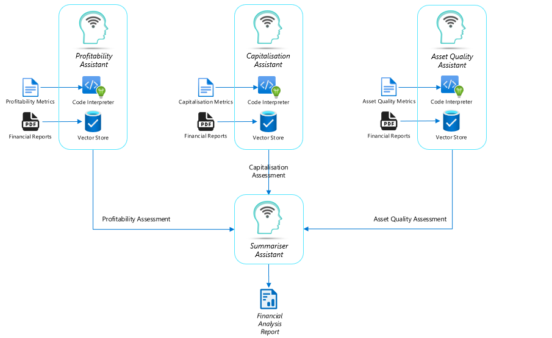

# Financial Analysis - Multi-Agent Pattern

This sample code demonstrates the use of a multi-agent pattern for analysing complex financial data for reporting. By using agents specialising in analysing areas such as profitability, capitalisation & asset quality, a summary containing the financial analysis is generated. The agents make use of the Assistants API in Azure OpenAI.

The solution is based on the multi-agent framework as described here - https://techcommunity.microsoft.com/t5/ai-azure-ai-services-blog/building-a-multimodal-multi-agent-framework-with-azure-openai/ba-p/4084007

## Key Capabilities

1. Usage of code interpreter for analysing metrics and file search for reviewing documents
2. Native vector store usage within the agents for chunking & embedding content  
3. Fact-checking of metrics against information found in documents such as reports
4. Extensible pattern that can incorporate additional agents for more complex use-cases

## Sample Output

### Detailed Financial Analysis Summary Report

#### <u>**Profitability Analysis**</u>

The organisation's profitability for the first half of 2024 has experienced a decline compared to the same period in 2023. Key factors contributing to this trend include:

1. **Revenue**:
   - Revenue decreased by 2.7% compared to 1H23, primarily due to lower margins and reduced Markets and Treasury (M&T) income, partially offset by volume growth. This decline reflects the competitive pressures in the lending market and the impact of higher term deposit costs.

2. **Net Interest Margin (NIM)**:
   - NIM decreased by 4 basis points to 1.22%. Excluding a 5 bps increase from M&T, NIM declined by 10 bps. This decline was driven by competitive pressures in lending margins, especially in housing lending, along with higher term deposit costs and deposit mix impacts. However, higher earnings on deposits and capital due to the rising interest rate environment partially offset these pressures.

3. **Operating Expenses**:
   - Operating expenses increased by 6.9%, mainly due to continued investment in technology and compliance capabilities, including fraud and cyber security, and higher average FTE and salary-related expenses. These impacts were partially offset by productivity benefits.

4. **Underlying Profit**:
   - Underlying profit decreased by 8.6% compared to 1H23. This decline was attributed to the combination of lower revenue and higher expenses.

Overall, the organisation's profitability was impacted by a challenging economic environment, competitive pressures, and increased operational costs. However, strategic investments in technology and compliance are expected to support long-term growth and efficiency improvements.

#### <u>**Capitalisation Analysis**</u>

The organisation's capitalisation remains robust, with a strong capital position supported by prudent provisioning and effective capital management practices:

1. **Common Equity Tier 1 (CET1) Ratio**:
   - The CET1 ratio as of March 2024 is 12.15%, a slight decrease of 6 basis points from September 2023. This decrease includes the benefit of lower Interest Rate Risk in the Banking Book (IRRBB) Risk-Weighted Assets (RWA).

2. **Share Buy-Backs**:
   - The organisation conducted significant share buy-backs, which impacted the CET1 ratio. Up to $1.2 million worth of shares were bought back by March 2024, with an additional $1.1 million buy-back announced.

3. **Provision to Credit Risk-Weighted Assets**:
   - Collective provisions remain prudently set at 1.36% of credit risk-weighted assets, indicating a cautious approach to provisioning and ensuring adequate coverage for potential credit losses.

The organisation's capitalisation remains strong, with a CET1 ratio above the target range of 10.0-10.5%, supporting sustainable growth and returns for shareholders.

#### <u>**Asset Quality Analysis**</u>

The organisation's asset quality has shown some deterioration, but it remains manageable:

1. **90+ Days Past Due (DPD) and Gross Impaired Assets**:
   - The ratio of 90+ days past due and gross impaired assets to gross loans and acceptances increased by 12 basis points to 0.59% as of March 2024. This increase mainly reflects higher arrears across the Australian home lending and business lending portfolios, partially offset by lower impaired assets.

2. **Credit Impairment Charge (CIC)**:
   - The credit impairment charge for the first half of 2024 was $253 million, compared to $283 million in the first half of 2023. The 2024 charge includes a $30 million release from forward-looking provisions. Underlying charges primarily reflect volume growth, higher arrears, and a modest increase in specific charges, partially offset by the impact of higher house prices.

3. **Economic Conditions**:
   - The organisation's asset quality trends are influenced by the broader economic environment, including the impacts of global instability, higher interest rates, and elevated cost of living pressures. Despite these challenges, the Australian economy has shown resilience, and most customers are managing well.

The organisation continues to manage its asset quality effectively, with a cautious approach to provisioning and a focus on maintaining a strong capital position to support sustainable growth and returns for shareholders.

### Conclusion

In summary, the organisation's financial performance for the first half of 2024 reflects a challenging economic environment with competitive pressures and increased operational costs impacting profitability. However, the organisation's capitalisation remains strong, supported by prudent provisioning and effective capital management practices. Asset quality has shown some deterioration, but it remains manageable, with a cautious approach to provisioning and a focus on maintaining a strong capital position. Strategic investments in technology and compliance are expected to support long-term growth and efficiency improvements, positioning the organisation well for future challenges and opportunities.